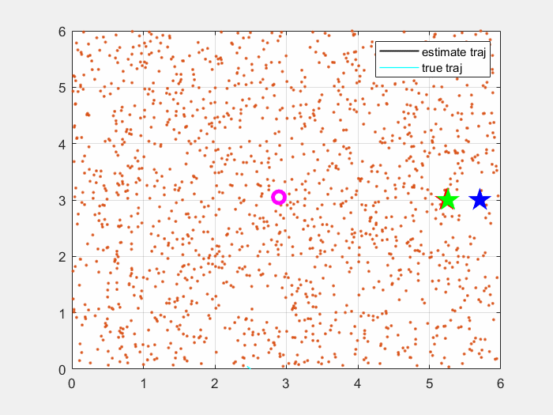

# RGB Light Landmark-Based SLAM
MEEN 689 Term Project

# About
A matlab version of landmark-based SLAM using RGB light as landmarks.

# How To Run
**\[Run a simulation\]:**  
```Matlab
load('Input\test_input.mat');  
PF = RunSLAM(Ut, Zt, 1500, lmY, 1); % Run Particle Filter SLAM
[ekf traj] = RunEkfSLAM(Ut, Zt, 1); % Run EKF SLAM
```

**\[Run a real data\]:** 
```Matlab
load('Input\test_data0421.mat');
[ekf traj] = RunEkfSLAM(U, rgb_d, 0);
```

# Detail
Three light bults and a smartphone is everything we have.  
We used our smartphone as the mobile robot, estimating its motion displacement by its accelerometer, GPS, gyroscope and magnetometer, and measuring the distance to three light bults by its RGB camera.  

We implemented two kinds of SLAM: EKF SLAM and Particle Filter SLAM. We set the y-positions of three landmarks as known parameters to simplify the problem. The simulation data and real world test data are provided in the "input" file. The simulation results are shown in the next section. The real world test results, however, are not accurate as the simulation results since we only have a smartphone as our sensor. 


# Simulation
Run Particle Filter SLAM with
  number of particles: 2000  
  process noise variacne: 0.03  
  measurement noise variance: 1  
    
  
Run EKF SLAM with  
  process noise variacne: 0.03  
  measurement noise variance: 1  
    
  

  
